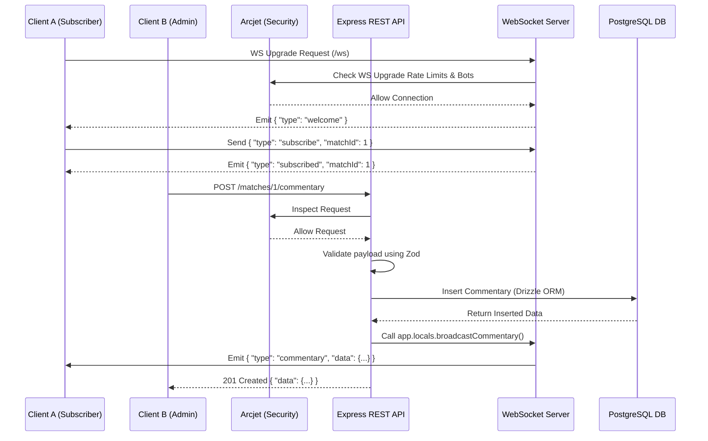

# Sportz WebSockets

Sportz WebSockets is a real-time sports application backend built with Node.js. It provides the foundation for managing sports matches, live commentary, and real-time score updates using WebSockets.

The application is built using Node.js (ES Modules), Express, Drizzle ORM, Zod for schema validation, a Neon PostgreSQL database, and Arcjet for advanced rate limiting and bot protection.

## Project At A Glance

- **Database:** Schema managed via Drizzle ORM featuring `matches` and `commentary` tables, backed by Neon Serverless Postgres.
- **Validation:** Robust Zod validation schemas to ensure data integrity during match creation and score updates.
- **Real-Time Engine:** Native WebSocket integration to instantly broadcast events (like `match_created`) to connected clients.
- **Security & Rate Limiting:** Integrated with `@arcjet/node` for advanced WAF rules, bot detection, and sliding window rate limiting.

## Tech Stack

- Node.js (ES Modules)
- Express `5.2`
- WebSockets (`ws`)
- PostgreSQL (via `pg` `8.22`)
- Drizzle ORM `0.45`
- Zod `4.4`
- Arcjet `@arcjet/node` `1.7`

## System Architecture & Data Flow

The following sequence diagram maps out the core data flow, showing how REST API updates seamlessly broadcast real-time events to connected WebSocket clients securely using Arcjet.



## Database Schema

Sportz WebSockets leverages Drizzle ORM paired with Neon Serverless Postgres. The schema is organized into two primary tables:

- **`matches`**: Tracks core match data. Features a custom `match_status` Postgres Enum (`scheduled`, `live`, `finished`) computed dynamically based on start and end times. Stores team names, schedules, and tracks live scores.
- **`commentary`**: Stores real-time play-by-play events. It utilizes a foreign key (`match_id`) linking back to the parent match. It leverages advanced data types including `jsonb` for flexible `metadata` payloads (e.g., player stats) and text arrays for filterable `tags`.

## Security & Validation

Every incoming request passes through robust protection and strict validation layers:

- **Arcjet Protection**: The `@arcjet/node` middleware protects both standard REST routes and the WebSocket upgrade handshake. It applies a `slidingWindow` rate limit (e.g., 50 reqs/10s for HTTP, 5 reqs/2s for WS) and a `detectBot` policy that actively blocks unauthorized automated tools while allowing verified search engine crawlers.
- **Zod Data Validation**: Housed in `src/validation/`, strict Zod schemas enforce type safety at runtime. Our match creation schema utilizes `superRefine` hooks to guarantee chronological integrity (i.e., `endTime` must be strictly after `startTime`), and forces scores and IDs to be non-negative integers.

## API Endpoints

### Default

<details>
<summary><code>GET</code> <code><b>/</b></code> <span>(Health check endpoint)</span></summary>

**Responses**

- `200 OK`: `sportz-backend running`
</details>

### Matches

<details>
<summary><code>GET</code> <code><b>/matches</b></code> <span>(Retrieves a list of matches)</span></summary>

**Query Parameters**

- `limit` _(integer, optional)_: Max 100, default 50.

**Responses**

- `200 OK`: JSON payload containing `{ data: [...] }`.
</details>

<details>
<summary><code>POST</code> <code><b>/matches</b></code> <span>(Creates a new match)</span></summary>

**Body Payload**

- `sport` _(string, required)_
- `homeTeam` _(string, required)_
- `awayTeam` _(string, required)_
- `startTime` _(ISO 8601 date string, required)_
- `endTime` _(ISO 8601 date string, required, must be > startTime)_
- `homeScore` _(number, optional, default: 0)_
- `awayScore` _(number, optional, default: 0)_

**Responses**

- `201 Created`: JSON payload containing `{ data: [...] }`.
_(Note: Broadcasts a `match_created` event to all active WebSocket clients)_
</details>

### Commentary

<details>
<summary><code>GET</code> <code><b>/matches/:id/commentary</b></code> <span>(Retrieves a list of commentary events for a match)</span></summary>

**Path Parameters**

- `id` _(positive integer, required)_: The ID of the match.

**Query Parameters**

- `limit` _(integer, optional)_: Max 100, default 100.

**Responses**

- `200 OK`: JSON payload containing `{ data: [...] }`.
</details>

<details>
<summary><code>POST</code> <code><b>/matches/:id/commentary</b></code> <span>(Creates a new commentary event for a match)</span></summary>

**Path Parameters**

- `id` _(positive integer, required)_: The ID of the match.

**Body Payload**

- `minute` _(integer, optional)_: Non-negative.
- `sequence` _(integer, optional)_
- `period` _(string, optional)_
- `eventType` _(string, optional)_
- `actor` _(string, optional)_
- `team` _(string, optional)_
- `message` _(string, required)_
- `metadata` _(object, optional)_
- `tags` _(array of strings, optional)_

**Responses**

- `201 Created`: JSON payload containing `{ data: {...} }`.
</details>

## WebSocket Protocol

Connect:

`ws://localhost:8000/ws`

### Client → Server

```json
{ "type": "subscribe", "matchId": 123 }
```

```json
{ "type": "unsubscribe", "matchId": 123 }
```

### Server → Client

```json
{ "type": "welcome" }
```

```json
{ "type": "subscribed", "matchId": 123 }
```

```json
{ "type": "unsubscribed", "matchId": 123 }
```

```json
{ "type": "match_created", "data": { "id": 1, "homeTeam": "FC Neon", "awayTeam": "Drizzle United", "sport": "football", "startTime": "...", "endTime": "...", "homeScore": 0, "awayScore": 0, "status": "scheduled" } }
```

```json
{ "type": "commentary", "data": { "id": 1, "matchId": 123, "message": "..." } }
```

```json
{ "type": "error", "message": "Invalid JSON" }
```

### Limits

- Rate limit: 5 messages / 2 seconds (Arcjet default)
- Max message payload: 1 MB

## Getting Started

Install dependencies from the project directory:

```bash
npm install
```

Configure your environment by creating a `.env` file in the root directory. Add your Neon PostgreSQL connection string and your Arcjet API key:

```env
DATABASE_URL="postgresql://[user]:[password]@[neon_hostname]/[dbname]?sslmode=require&channel_binding=require"
ARCJET_KEY="your-arcjet-key-here"
```

Start the local dev server:

```bash
npm run dev
```

## Available Scripts

Run scripts from `sportz-backend/`.

| Command               | Purpose                                                                                |
| --------------------- | -------------------------------------------------------------------------------------- |
| `npm run dev`         | Starts the dev server with automatic file watching using Node's native `--watch` flag. |
| `npm start`           | Starts the Node.js application normally for production-like execution.                 |
| `npm run db:generate` | Uses Drizzle Kit to generate SQL migration files based on schema changes.              |
| `npm run db:migrate`  | Uses Drizzle Kit to apply the generated migrations to your Neon database.              |

## Common Workflows

### Development

```bash
npm run dev
```

Use this for day-to-day backend work. Node.js automatically watches for file changes and restarts the server.

### Database Migrations

```bash
npm run db:generate
npm run db:migrate
```

Run these commands sequentially whenever you update the Drizzle schema in `src/db/schema.js`. This ensures your Neon PostgreSQL database stays in sync with your application models.

## App Structure

```text
src/
  index.js                Main application entry point
  arcjet.js               Arcjet security middleware, bot protection, and rate limiting
  ws/
    server.js             WebSocket server logic and broadcasting rules
  routes/
    matches.js            Express routes for the /matches API
    commentary.js         Express routes for the /matches/:id/commentary API
  db/
    db.js                 Database connection and client setup
    schema.js             Drizzle ORM schema definitions (tables, enums)
  validation/
    matches.js            Zod validation schemas for match data
    commentary.js         Zod validation schemas for commentary data
  utils/
    match-status.js       Utility for computing live/scheduled/finished status
```

## Notes And Caveats

- The database connection relies on a valid `DATABASE_URL` in the `.env` file. The app will throw an error if this is missing.
- Arcjet security requires a valid `ARCJET_KEY` in your `.env`. If not provided, the security middleware will simply be bypassed (useful for local development).
- The generated `drizzle/` directory contains your SQL migrations. These should generally be committed to version control.
- Ensure `.env` is listed in your `.gitignore` to prevent leaking database credentials and API keys.

## Useful Files

- `drizzle.config.js` - Configuration for Drizzle Kit (dialect, schema path, database URL).
- `package.json` - npm scripts and project dependencies.
- `.env` - Local environment variables.
